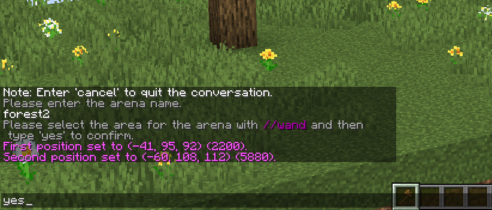
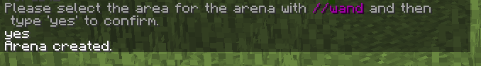

import { Steps } from "@astrojs/starlight/components";

To create an arena use the following command:

```text
/nda arena create
```

This will guide you through the creation process:

<Steps>

1. Enter the arena name

    

2. Select the region using WorldEdit, (`//wand` for example)

    

    :::tip

    Select the smallest region possible to improve performance.

    :::

3. Confirm the creation by using `yes`

    

4. The arena will be created

</Steps>

:::note

Use `cancel` to cancel the creation process.

Or wait 2 minutes :)

:::
