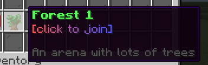

import { Image } from "astro:assets";
import forest1DisplayNameImg from "../../../assets/docs/guides/customizing-arenas/forest1-display-name.png";

## Changing the Display Name

To change the display name of an arena use the following command:

```mcfunction
/nda arena setDisplayName <arena name> <display name>
```

The display name argument expects a string in the [legacy format](https://docs.advntr.dev/serializer/legacy.html).

For example, the command:

```mcfunction
/nda arena setDisplayName forest1 &a&lForest 1
```

Will change the display name of the arena `forest1` to <Image style="vertical-align: middle; display: inline;" alt="green and bold Forest 1 text" src={forest1DisplayNameImg} />

## Changing the Description

To change the description of an arena use the following command:

```mcfunction
/nda arena setDescription <arena name> <display name>
```

The description argument expects a string in the [MiniMessage format](https://docs.advntr.dev/minimessage/format.html).

For example, the command

```mcfunction
/nda arena setDescription forest1 <gradient:red:blue>[click to join]</gradient><br><br><dark_gray>An arena with lots of trees</dark_gray>
```

Will produce the following description:



## Changing the Item

To change the item that represents an arena in the GUI use the following command:

```mcfunction
/nda arena setItem <arena name> <item>
```
