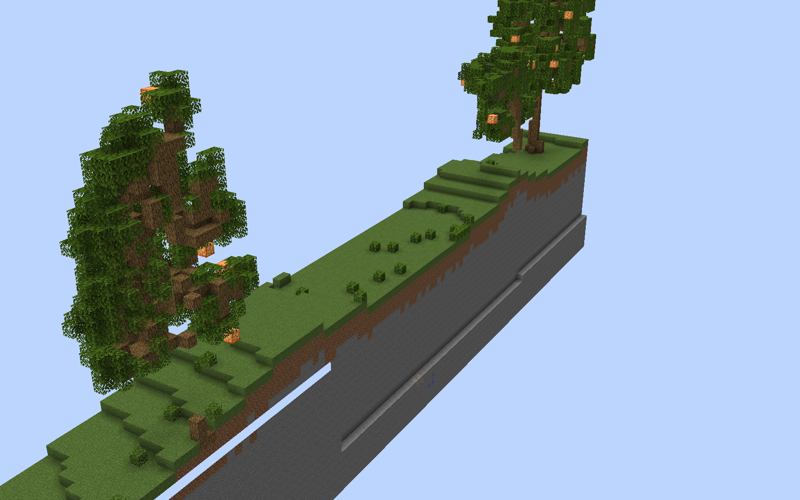

:::note

Arena resetting is only available if you have it enabled in the configuration.

TODO

:::

An arena can be resetted after for example a round has ended.

To force reset an arena use the following command:

```text
/nda arena load <arena>
```

## The load process

The load process works by simply replacing all blocks in the arena with the blocks loaded from the arena file under `plugin_dir/arenas/<arena>`.

By default 250 blocks are loaded every tick, this can be changed in the arena settings. (TODO)
